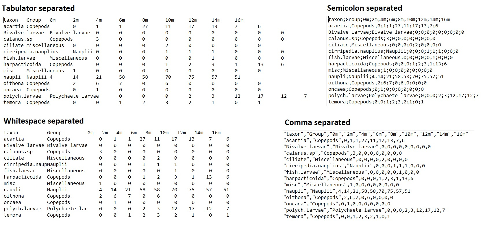
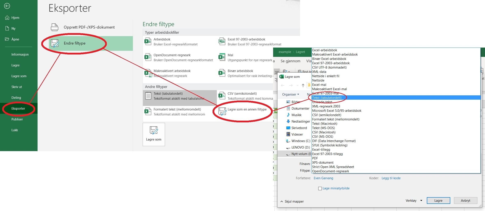

<style type="text/css">

.subtitle { font-size: 24px; }

.author { font-size: 16px; 
  font-style: italic;
  }

.date { font-size: 16px; 
  font-style: italic;
  }

h1 { font-size: 28px; }

h2 { font-size: 24px; }

h3 { font-size: 20px; }
</style>

```{r setup, include=FALSE}
knitr::opts_chunk$set(echo = TRUE, 
                      fig.width = 5, 
                      fig.asp = 0.618, 
                      comment = "#>",
                      warning = FALSE,
                      message = FALSE,
                      collapse = TRUE)
```

_Last updated 2020-01-16: Added some special instructions for Rmarkdown users._

This guide is a part of a series of short tutorials. Find all the tutorials [here](https://evengar.github.io/short-tutorials/).

# Introduction

At some point as a biologist you will have your own data to work with, and you will have to import it into R to use all its powerful tools. However, it's not given that your data is easy to import, unless you think about how to format it beforehand. This guide will help you get your data into R and start working. Section \@ref(tips) is optional, but contains some general tips for working with data.

**If you don't want the details, just a cheat-sheet of what function to use for what kind of data, see section \@ref(cheat)**

## Prerequisites

For this tutorial we will use the following:

* [This](https://github.com/evengar/short-tutorials/raw/master/example.xlsx) data set
* The package `readxl`

If you don't have readxl installed, you can install it by running the command `install.packages("readxl")`. Make sure you download the data set to your current R working directory. You can set your working directory either by running `setwd()` and manually inputting a path, or simply by navigating to `Session > Set working directory` in RStudio.

_Update 2020-16-01:_ It turns out that if you use Rmarkdown when importing files, it's important that the .Rmd file and the data file is located in the same folder, or it won't work. This is probably because Rmarkdown handles working directories somewhat differently than an R script does, but I don't know any further details about this. Anyways, it's good practice to keep all the files that work together in the same folder.

<style>
div.blue { background-color:#e6f0ff; border-radius: 5px; padding: 20px;}
</style>
<div class = "blue">

**Tip:** If you learn to use the project-feature in Rstudio, you will never have to worry about working directories again! When you create a new project with `File > New Project...` you will associate it with a working directory, and each time you open your project, it defaults to that directory. As long as you save all your project's files in that directory you're good!

</div>

# Working with data files in R
## Data formats

You can import many data formats into R, including:

* Excel (.xls, .xlsx)
* RData files, a format specifically for using with R
* Plain text documents with data entries separated by:
  * comma, called csv
  * semicolon, confusingly also called csv (although sometimes called csv2)
  * any number of whitespace (spaces, tabulators etc.)
  * tabulator, often called tsv (a special case of whitespace separation)


For the plain text documents, the file extensions sometimes tell you what you are working with (e.g.: .csv for comma separated values), other times they may be encoded as .txt documents. This means that you often have to open the document in a text editor (e.g. Notepad) to see how the data is formatted before you import it. Figure \@ref(fig:formats) shows how the same document looks in different formats. I strongly recommend storing your data in the plain text formats over Excel, since that makes working across platforms and programs much easier, as well as not requiring a proprietary program to open.

\

```{r formats, out.width="80%", echo=FALSE, fig.cap="The data from example.xlsx in different plain-text formats"}

```


## Exporting from Excel

While Excel is not recommended for importing your finished dataset, it is good for inputting data. Therefore, it's likely that you will have your data in an .xlsx-file when you start working with it. Now, we could just import it with `read_xlsx()` from the readxl package (remember to install it first!), like this:

```{r readxl}
library(readxl)
read_xlsx("data/example.xlsx")
```

For our data, this works fine. However, we should strive to use the plain text format for reasons outlined above. To do this we have to export from Excel. Go to `File > Export` to choose a format. I'm going with tabulator separation, see Figure \@ref(fig:export) (which unfortunately is in Norwegian, sorry non-norwegian speakers!).

```{r export, echo=FALSE, fig.cap = "How to export a file to a tsv (in Norwegian)"}

```


<div class = "blue">

**Tip:** csv's can be troublesome because the european standard is to separate decimals by commas and data by semicolon, while the scientific standard is to use period as the decimal marker and commas to separate data. This is the reason why I personally mostly choose tsv's when I export data. However, csv is probably the most common format you will encounter, and is worth getting familiar with.

_Also, you should probably consider changing your Excel's decimal marker from comma to period right away, as this will save you some headaches in the future. It is also possible to change your computers regional settings to an English speaking country, then period will be the decimal marker by default._

</div>

## Importing into R

### Plain text files
Now that we have our file (tsv or whatever you chose) we can read our data into R! The generic function for importing data in R is called `read.table()`. The function takes many arguments, but for the most important in the beginning are `header`, `sep` and `dec`:

* `header` is either `TRUE` or `FALSE`, and depends on whether or not the first line in our data is a header. This means you almost always specify `header = TRUE`.
* `sep` is related to the data formats we have been talking about up to now, and tells how the values in the data are separated. It defaults to reading both tabulator separation and any kind of other whitespace separation, so for those formats you don't have to specify `sep`. If you do want to specify, it would be `sep = "\t"` for tabulator and `sep = " "` for a single space. For comma separated values, you would set `sep = ","`, and for semicolon separated values you would set `sep = ";"`.
* `dec` is the decimal marker, either `dec = "."` or `dec = ","`

Since my data is tabulator separated, is called "example.tsv.txt" (yours may be in a different format and called something else) and has a header, i will import it the following way:


```{r, results = "hide"}
my_data <- read.table("data/example.tsv.txt", header = TRUE, sep = "\t", dec = ".")
my_data
```

```{r, echo = FALSE}
knitr::kable(my_data)
```

Congratulations, your data is now imported to R!

As a side note, there are also specific functions for reading in different plain text documents, namely `read.csv()` for comma separation, `read.csv2()` for semicolon separation with comma as decimal marker, and `read.tsv()` for tabulator separation.

### RData files {#rdata}

RData files are made specifically for working with R. RData files can contain many objects at once, which are all loaded into your environment when you load the file. They can contain any kind of object, while the plain text formats I have discussed above only can contain a data.frame. This makes it ideal for sharing your data with other researchers, making sure it appears the same across computers and operating systems.

You seldom have the luxury of getting a prepared RData file to work with, but when you do, all you have to do is use either the `load()` or `readRDS()` function. Be aware that `load()` may overwrite some of your current objects if they have the same name as those stored in the RData-file. See below for an example of this behavior, where the object `a` is overwritten by loading the stored "a.RData":

```{r}
# create a vector
a <- c(1, 2, 3)

# save vector as an RData-file
save(a, file = "a.RData")

# create a new object called a
a <- c(2, 3, 4)

# load the previously saved object called a
b <- load("a.RData")

# print the results
a
b
```

As we can see, `a` is overwritten by the saved object! Additionally, `b` only contains the name of the imported variable, which is not that useful. Stay clear of this pitfall, and you will be fine when working with RData-files. If we use the `readRDS()` function with a .rds-file instead, we don't get this problem:

```{r}
# create a
a <- c(1, 2, 3)

# save it
saveRDS(a, "a.rds")

# Create a new a, different from the saved one
a <- c(2, 3, 4)

# load the saved object a, using readRDS()
b <- readRDS("a.rds")

# print to check:
a
b

```

This is a better behavior, but an .rds file can only contain one object, making it less useful than .RData in many cases.

### Cheat sheet for data import {#cheat}

Here is a quick-reference guide for what arguments to use to read in a file (remember to almost always specify `header = TRUE` for the `read.*` functions):

* **csv:** `read.csv()` or `read.table("file.txt", sep = ",", dec = ".")`  
* **semicolon separated csv:** `read.csv2()` or `read.table("file.txt", sep = ";", dec = ",")`  
* **whitespace separated data (including tsv):** `read.table()`  
* **excel document:** `read_xls()` or `read_xlsx()`
* **.RData:** `load()`
* **.rds:** `readRDS()`


## Writing to files

After working with your data, you might want to export it to a file again for use with other programs or scripts. You can write to either a plain text document or a R data file.

### Text document

For writing to a text document, you can use `write.table` and `write.csv`. You have many options on how to write your file, but the least you need is an R object and a filename.

```{r wrttbl, eval = FALSE}
write.table(my_data, "my_data.txt")

## OR

write.csv(my_data, "my_data.csv")
```

<div class = "blue">

**NOTE:** Be careful when writing to files. If the file you are writing has the same name as an existing file, R will overwrite the old file without a warning. Do not run a write-command without being certain that everything is correct.

</div>

### R data files

When writing to an R data file you use the functions `save` and `saveRDS`. The former can store many objects in an .RData file, while the latter can store one object in an .rds file. For more differences see section \@ref(rdata).

```{r, eval = FALSE}
# saving multiple objects
save(my_data, a, b, file = "all_objects.RData")

# saving a single object
saveRDS(my_data, file = "one_object.rds")
```

The `save` function is useful in that you can store many objects of different classes, and subsequently load them all together. Beware, however, of the behavior outlined in \@ref(rdata) to avoid overwriting your objects.

# Some tips {#tips}

## Record data in a sensible way

To avoid as much hassle as possible, I recommend thinking about how you enter your data (into e.g. excel) before starting your project. You should strive to write it in a format where the first row contains the variable names, and all your columns are of equal length. If you record data in this format, it should be a piece of cake to import it into R with the `read.table` function.

## Stop using excel at some point

Another tip is to finalize your excel sheet and export it to a plain text document, then never edit your raw data again
^[Of course, "never" is a really strong word to use here. The point is, think twice before going back into excel to adjust some numbers or input new data.].
If you for some reason have to edit a column or some cells later, you should do so in R. This way you can explain why you did the edit in your script or Rmarkdown-document, making your data science reproducible.

## Tidy your data

When recording your data, you are likely to record it in a way that is not optimal for use with R. The document we imported in this exercise is in a format that is easy to use when counting your samples, but should be modified afterwards to work better with plotting and other operations. The data structure R works best with is:

1. One variable per column
2. **One observation per row**
3. One value per cell

This is called tidy data, or sometimes data in "long format". Our example.xlsx violates the second rule, having more than one observation per row (the counts for each depth are different observations). You may achieve the goal of tidy data in several ways, but I prefer using the packages in `tidyverse` (remember to install it if you want to try the code) for this.

```{r}
library(tidyverse)
my_data_tidy <- gather(my_data, X0m:X16m, key = depth, value = count)
head(my_data_tidy, 10)
```

I won't go further into the details here, but I really recommend Grolemund and Wickham's [R for Data Science](https://r4ds.had.co.nz/) in general, and the chapter about [tidy data](https://r4ds.had.co.nz/tidy-data.html) specifically for learning more about this.


